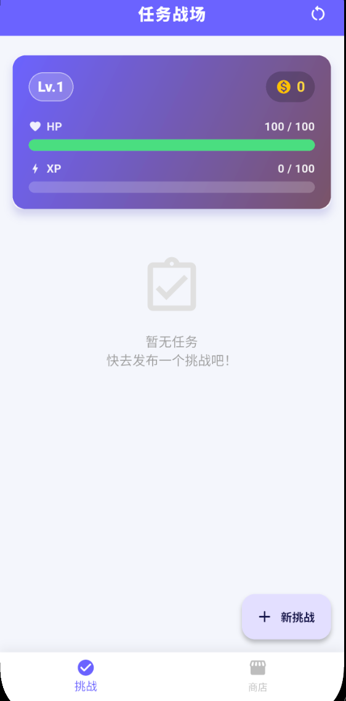
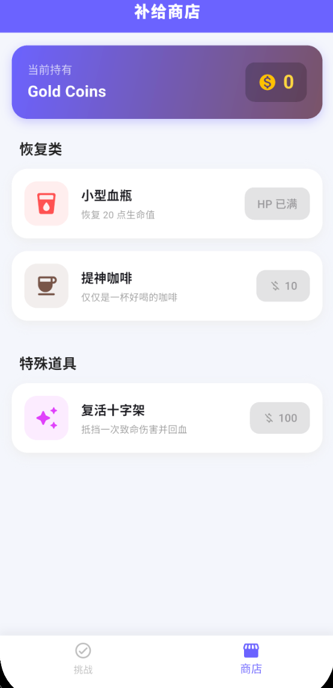

---

### 📄 `README.md`

```markdown
# ⚔️ Hero Journey (英雄之旅)

> **把你的生活变成一场英雄冒险！** > Turn your life into a hero's adventure!

**Hero Journey** 是一款基于 **Flutter** 开发的 RPG 风格待办事项应用 (Gamified To-Do List)。它将枯燥的任务管理转化为打怪升级的游戏体验。完成任务获得经验和金币，任务过期则会受到伤害。用金币在商店购买装备，努力成为更好的自己！

---

## 📸 预览 (Preview)

| 🏠 任务战场 | 🛍️ 补给商店 | ⚔️ 侧滑操作 |
|:---:|:---:|:---:|
|  |  |  |

---

## ✨ 核心功能 (Features)

### 🎮 RPG 游戏化系统
* **属性系统**：拥有 HP (生命值)、XP (经验值)、Gold (金币) 和 Level (等级)。
* **奖惩机制**：
    * ✅ 完成任务：获得金币、经验，触发升级撒花特效 🎉。
    * ❌ 任务过期：扣除生命值，触发**屏幕震动** (Screen Shake) 和**手机震动** (Haptic Feedback) 💥。
    * ☠️ 死亡惩罚：HP 归零时游戏结束，等级重置（除非拥有复活道具）。

### ✅ 强大的任务管理
* **智能排序**：自动按“今天”、“明天”、“以后”、“已过期”进行分组和折叠。
* **交互体验**：
    * 支持**侧滑菜单**：左滑任务卡片进行编辑 ✏️ 或删除 🗑️。
    * **折叠收纳**：点击标题栏可折叠/展开任务组，保持界面整洁。
* **提醒服务**：集成系统级通知，不错过任何截止日期。

### 🛍️ 商店与道具
* **小型血瓶**：花费金币恢复生命值。
* **复活十字架**：抵挡一次致命伤害并回血（被动触发）。
* **动态状态**：买不起、满血或已拥有道具时，按钮会自动禁用并提示。

### 🎨 现代 UI/UX
* **高颜值界面**：蓝紫渐变风格，磨砂质感卡片。
* **沉浸式反馈**：
    * 升级/购买/受击均有**专属音效** 🎵。
    * 操作时伴随细腻的**触觉反馈**。
* **自定义图标**：拥有独特的宝剑应用图标。

---

## 🛠️ 技术栈 (Tech Stack)

本项目使用 **Flutter** 构建，兼容 Android 和 iOS。

* **核心框架**: Flutter SDK
* **语言**: Dart
* **关键依赖库**:
    * `shared_preferences`: 本地数据持久化（自动保存进度）。
    * `flutter_slidable`: 实现列表项的侧滑菜单。
    * `confetti`: 升级时的粒子撒花特效。
    * `audioplayers`: 游戏音效播放。
    * `flutter_local_notifications`: 本地消息推送。
    * `intl`: 日期时间格式化。
    * `flutter_launcher_icons`: 自动生成应用图标。

---

## 📂 项目结构 (Project Structure)

代码采用了模块化结构，易于维护和扩展：

```text
lib/
├── main.dart              # 程序入口与主逻辑 (Controller)
├── models/
│   └── task.dart          # 任务数据模型
├── services/
│   ├── audio_service.dart # 音效服务
│   ├── storage_service.dart # 数据存储服务
│   └── notification_service.dart # 通知服务
└── widgets/
    ├── add_task_dialog.dart # 添加/编辑任务弹窗
    ├── task_tile.dart       # 任务卡片 (含侧滑逻辑)
    ├── shop_page.dart       # 商店页面
    ├── status_header.dart   # 顶部属性栏 (HP/XP条)
    ├── shake_widget.dart    # 屏幕震动组件
    └── game_dialogs.dart    # 游戏相关弹窗 (升级/复活/GameOver)

```

---

## 🔮 未来计划 (Future Plans)

* [ ] **每日循环任务**：支持设置每日打卡习惯。
* [ ] **背包系统**：购买道具后存入背包，按需使用。
* [ ] **成就系统**：统计完成任务数量，解锁成就徽章。
* [ ] **多主题切换**：支持深色模式 (Dark Mode)。

---

## ❤️ 致谢

感谢所有为这个项目提供灵感的 RPG 游戏！

Created with ❤️ by [songlongs

---

